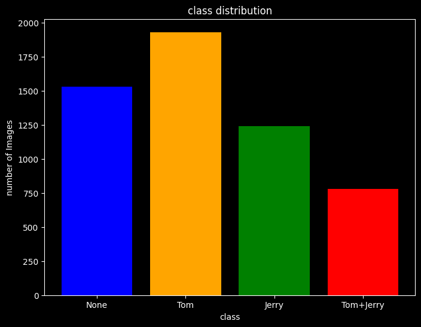

# AI Principles and Methods

## Overview

This repository demonstrates the implementation of three image classification methods of varying complexity using the Tom and Jerry Image Classification dataset from Kaggle. The project is designed to illustrate fundamental AI principles and methods, showcasing how different approaches can be applied to the same task with increasing sophistication.

The goal is to classify images from the Tom and Jerry cartoon series into categories based on the presence of characters: 
- None (neither Tom nor Jerry)
- Tom (only Tom)
- Jerry (only Jerry)
- Tom+Jerry (both Tom and Jerry)

These methods range from traditional machine learning techniques to advanced deep learning models.

## Dataset

The dataset used is the [Tom and Jerry Image Classification](https://www.kaggle.com/datasets/balabaskar/tom-and-jerry-image-classification) from Kaggle.

- **Description**: A collection of 5,478 images extracted from Tom and Jerry cartoon show videos available online. The images are labeled according to the presence of the characters Tom and/or Jerry.
- **Structure**:
  - The dataset is organized into `train` and `test` directories.
  - Each directory contains subfolders representing the classes:
    - `None`: Images containing neither (background/other) – labeled as "None".
    - `Tom`: Images containing only Tom.
    - `Jerry`: Images containing only Jerry.
    - `Tom+Jerry`: Images containing both Tom and Jerry – labeled as "Tom+Jerry".
  - Class Distribution (Total: 5,478 images):

    
    - None: 1,528 images (27.89%)
    - Jerry: 1,240 images (22.64%)
    - Tom: 1,930 images (35.23%)
    - Tom+Jerry: 780 images (14.24%)
  - Images are in standard formats (e.g., JPEG) and vary in size, requiring preprocessing for model input.

To use the dataset, download it from Kaggle and place it in a `data/` directory within the repository.

## Methods Implemented

The project implements three classification methods of different complexities:

1. **Low Complexity: XGBoost (xgb)**
   - **Description**: A traditional machine learning approach using XGBoost, an efficient gradient boosting framework. Features are extracted from images (e.g., via flattening or basic preprocessing) and fed into the model for classification.
   - **Principles Demonstrated**: Ensemble learning, decision trees, and boosting techniques.

2. **Medium Complexity: Convolutional Neural Network (CNN)**
   - **Description**: A deep learning model built with Keras/TensorFlow, featuring convolutional layers to automatically extract features from images.
   - **Principles Demonstrated**: Convolutional operations, pooling, and backpropagation in neural networks.

3. **High Complexity: Vision Transformer (ViT)**
   - **Description**: An advanced transformer-based model using the pre-trained `google/vit-base-patch16-224` architecture, fine-tuned for the classification task. This leverages self-attention mechanisms for image processing.
   - **Principles Demonstrated**: Transformer architecture, attention mechanisms, and transfer learning.

## Requirements

- Python 3.8+
- CUDA 12.8
- Libraries:
  - numpy
  - pandas
  - scikit-learn
  - xgboost (for XGBoost)
  - opencv-python (for image processing)
  - torch and torchvision(for CNN and ViT)
  - transformers (for ViT)
  - matplotlib (for visualizations)

Install dependencies using:
```
pip install -r requirements.txt
```

## How to Run

1. Run each method with `notebook.ipynb`
2. Each script will load the data, train the model, evaluate on the test set (1,096 images), and output classification reports and accuracy metrics.

## Results

Evaluation is performed on a test set of 1,096 images. Below are the classification reports and accuracies for each method.

### 1. XGBoost
- **Accuracy**: 0.777 (77.7%)

| Class      | Precision | Recall | F1-Score | Support |
|------------|-----------|--------|----------|---------|
| None      | 0.78     | 0.76  | 0.77    | 305    |
| Tom       | 0.75     | 0.89  | 0.82    | 382    |
| Jerry     | 0.76     | 0.72  | 0.74    | 249    |
| Tom+Jerry | 0.91     | 0.62  | 0.74    | 160    |
| **Macro Avg** | 0.80 | 0.75 | 0.77 | 1096 |
| **Weighted Avg** | 0.78 | 0.78 | 0.78 | 1096 |

### 2. CNN
- **Accuracy**: 0.851 (85.1%)

| Class      | Precision | Recall | F1-Score | Support |
|------------|-----------|--------|----------|---------|
| None      | 0.83     | 0.83  | 0.83    | 305    |
| Tom       | 0.89     | 0.89  | 0.89    | 382    |
| Jerry     | 0.82     | 0.88  | 0.85    | 249    |
| Tom+Jerry | 0.85     | 0.75  | 0.80    | 160    |
| **Macro Avg** | 0.85 | 0.84 | 0.84 | 1096 |
| **Weighted Avg** | 0.85 | 0.85 | 0.85 | 1096 |

### 3. Vision Transformer (ViT)
- **Accuracy**: 0.955 (95.5%)

| Class      | Precision | Recall | F1-Score | Support |
|------------|-----------|--------|----------|---------|
| None      | 0.92     | 0.98  | 0.95    | 305    |
| Tom       | 0.96     | 0.97  | 0.97    | 382    |
| Jerry     | 0.98     | 0.93  | 0.95    | 249    |
| Tom+Jerry | 0.97     | 0.91  | 0.94    | 160    |
| **Macro Avg** | 0.96 | 0.95 | 0.95 | 1096 |
| **Weighted Avg** | 0.96 | 0.96 | 0.96 | 1096 |

The results show progressive improvement in performance with increasing model complexity, highlighting the advantages of deep learning and transformer-based approaches for image classification tasks.
